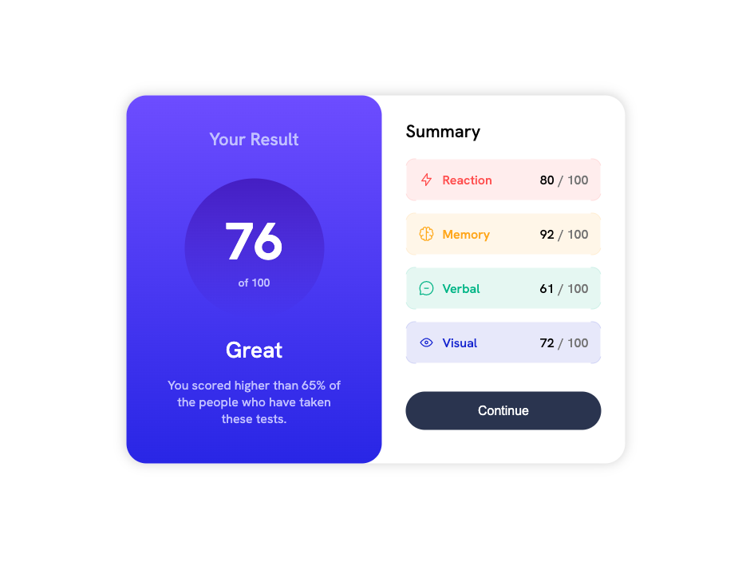

# Frontend Mentor - Results summary component solution

This is a solution to the [Results summary component challenge on Frontend Mentor](https://www.frontendmentor.io/challenges/results-summary-component-CE_K6s0maV). Frontend Mentor challenges help you improve your coding skills by building realistic projects. 

## Table of contents

- [Overview](#overview)
  - [The challenge](#the-challenge)
  - [Screenshot](#screenshot)
  - [Links](#links)
- [My process](#my-process)
  - [Built with](#built-with)
  - [What I learned](#what-i-learned)
  - [Continued development](#continued-development)
  - [Useful resources](#useful-resources)
- [Author](#author)

## Overview

### The challenge

Users should be able to:

- View the optimal layout for the interface depending on their device's screen size
- See hover and focus states for all interactive elements on the page

### Screenshot




### Links

- Solution URL: [Add solution URL here](https://your-solution-url.com)
- Live Site URL: [Add live site URL here](https://your-live-site-url.com)

## My process

### Built with

- Semantic HTML5 markup
- CSS custom properties
- Flexbox
- CSS Grid
- Mobile-first workflow


### What I learned

This is a great example for a first experience with Media Queries and with mobile oriented web development. Examples of things used here were: Flex, Media Queries, Pseudo-Elements, etc...
This was also my first use of SASS and most of the elements mentioned above.

```html
<ul>
  <li class="border border--red">
    <div class="list-item">
      </a>
      <p class="category--title">Reaction</p>
      <p class="category--score">80 <span>/ 100</span></p>
    </div>
  </li>
</ul>
```
```sass
.border
    position: relative
    display: flex
    border: 1px solid hsla(234, 85%, 45%, 20%)
    border-radius: 11px
    margin-bottom: 15px
    z-index: -1

    &::before
        z-index: -1
        content: ""
        position: absolute
        width: 90%
        height: calc(100% + 10px)
        background-color: white
        top: -5px
        left: 5%


    &::after
        content: ""
        position: absolute
        height: 70%
        width: calc(100% + 10px)
        background-color: white
        top: 15%
        left: -5px
        z-index: -1

    
    &.border--yellow
        border-color: hsla(39, 100%, 56%, 20%)

        .list-item
            background-color: hsla(39, 100%, 56%, 10%)
            color: hsl(39, 100%, 56%)


    &.border--red 
        border-color: hsla(0, 100%, 67%, 20%)

        .list-item
            background-color: hsla(0, 100%, 67%, 10%)
            color: hsl(0, 100%, 67%)
    
    &.border--blue
        border-color: hsla(234, 85%, 45%, 20%)

        .list-item
            background-color: hsla(234, 85%, 45%, 10%)
            color: hsl(234,85%, 45%)


    &.border--green
        border-color: hsla(166, 100%, 37%, 20%)
        
        .list-item
            background-color: hsla(166, 100%, 37%, 10%)
            color: hsl(166, 100%, 37%)
```

### Useful resources

- [CSS Responsive Design [MDN]](https://developer.mozilla.org/en-US/docs/Learn/CSS/CSS_layout/Responsive_Design) - Great resource for responsive design.
- [Pseudo-Element Corner Borders](https://stackoverflow.com/questions/14387690/how-can-i-show-only-corner-borders) - This is an amazing article which helped me finally understand a little more about pseudo-elements and helped me use corner borders.
- [Media Queries width [MDN]](https://developer.mozilla.org/en-US/docs/Web/CSS/@media/width) - Use of width and Media Queries.


## Author

- Frontend Mentor - [@andrecaldeiras](https://www.frontendmentor.io/profile/andrecaldeiras)
